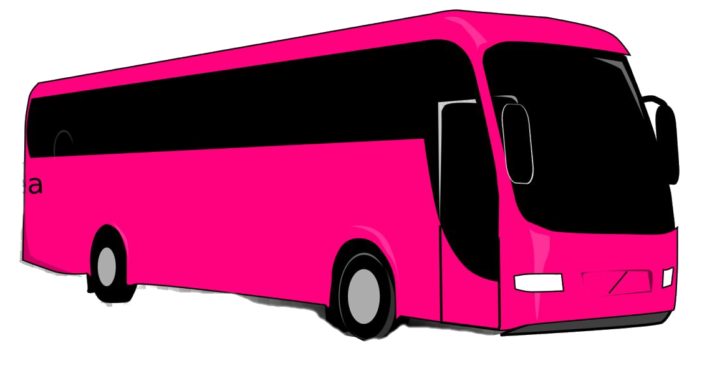

# Welcome to Beasy

*Still in development.*

## Getting started with animations on React

 This project purpose is to study animations on React using Motion Framer.

[Enjoy our live demo](https://blissful-bose-69a5ee.netlify.app/). Feedbacks are always nice :)

## About this project

This React.js project was bootstrapped with [Create React App](https://github.com/facebook/create-react-app). We're using ESLint and Prettier for code formatting.
All animations are made using [framer-motion](https://www.framer.com/motion/).
Majority of design components are made using [styled-component](https://styled-components.com/).
Developed by [André Treib](https://github.com/atreib).
